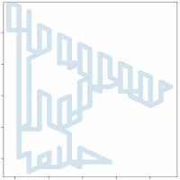
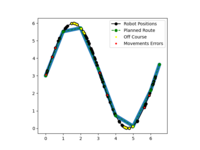
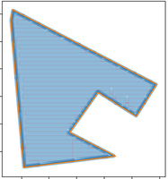
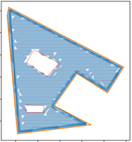

# MComp Lawn Mower Mapping
 
 Coverage mapping and route traversal algorithms for an automatic lawn mower.
 
 To use these methods supply `coverage.py` with a list of perimeter points in 
 latitude and longitude, optionally provide a list of nogo zones in the same format.
 
 The script will convert these into UTM, as the distances travelled are small 
 the curvature of the Earth should be negligible. UTM therefore, provides a quicker,
 and easier, way to calculate points, shapes, and graph the output. 
 
 Once completed an outputted graph showing the route and coverage of the robot can be shown.
 Changing the values of the robot's width, height, and desired overlap will change the output of said graph.
 
 The script will then output a series of test files containing UTM coordinates. One is a simplified version
 of the calculated route, and the others are the non-simplified versions with some noise added to simulate
 innacuracy and errors in the RTK values. 
 
 Once outputted these can be used by the traversal algorithm by *Making* `map` and running it. 
 The program will find and read the files, and output all points in which the robot was initially
 deemed off course. These points can be read, graphed and animated by `testing.py` by simply 
 running it.
 
# Examples 

	These examples can be found in larger verisions within './Images'

# References

The algorithm in its current state is based primarily on the work found in:
Song, M., Kabir, M. S. N., Chung, S. O., Kim, Y. J., Ha, J. K., & Lee, K. H. (2015). Path planning for autonomous lawn mower tractor. Korean Journal of Agricultural Science, 42(1), 63-71.

Chung, C. H., Wang, K. C., Liu, K. T., Wu, Y. T., Lin, C. C., & Chang, C. Y. (2020, September). Path planning algorithm for robotic lawnmower using RTK-GPS localization. In 2020 International Symposium on Community-centric Systems (CcS) (pp. 1-4). IEEE.

Further reading has been and will continue to be conducted therefore, this section will be updated when ever the implementation draws from those sources.
