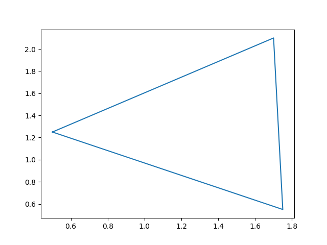
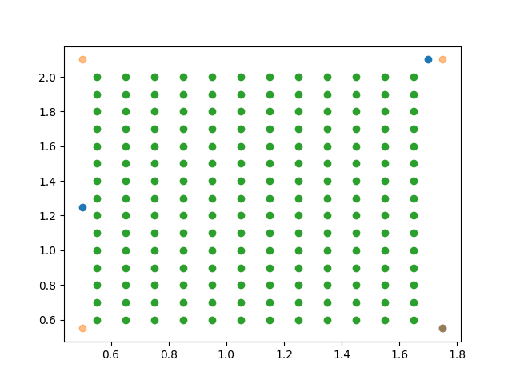
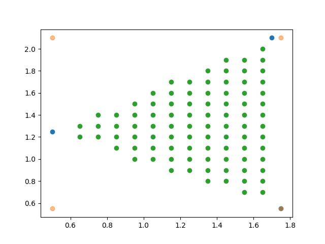
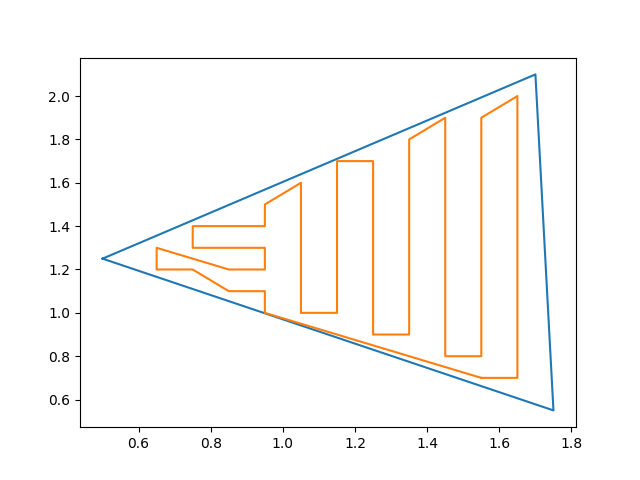
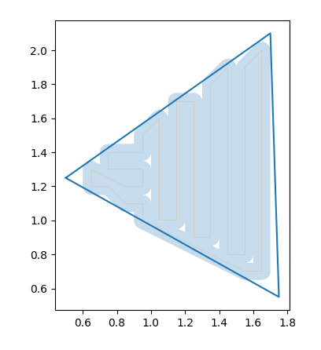
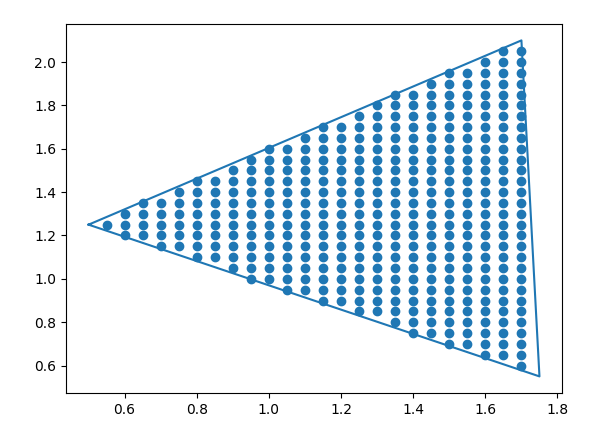
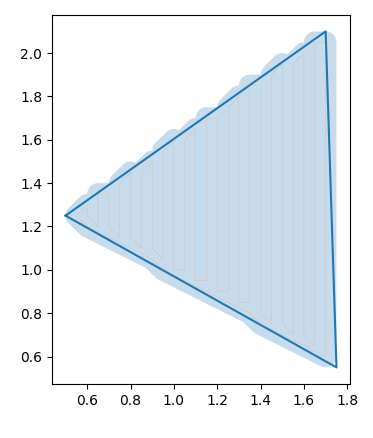
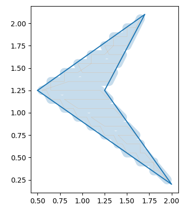
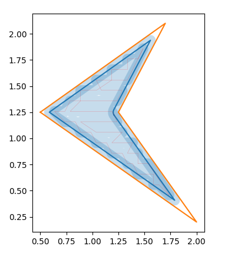

# MComp Lawn Mower Mapping
 
 Coverage mapping and route traversal algorithms for an automatic lawn mower.
 
 To use these methods supply `coverage.py` with a list of perimeter points in 
 latitude and longitude, optionally provide a list of nogo zones in the same format.
 
 The script will convert these into UTM, as the distances travelled are small 
 the curvature of the Earth should be negligible. UTM therefore, provides a quicker,
 and easier, way to calculate points, shapes, and graph the output. 
 
 Once completed an outputted graph showing the route and coverage of the robot can be shown.
 Changing the values of the robot's width, height, and desired overlap will change the output of said graph.
 
 The script will then output a series of test files containing UTM coordinates. One is a simplified version
 of the calculated route, and the others are the non-simplified versions with some noise added to simulate
 innacuracy and errors in the RTK values. 
 
 Once outputted these can be used by the traversal algorithm by *Making* `map` and running it. 
 The program will find and read the files, and output all points in which the robot was initially
 deemed off course. These points can be read, graphed and animated by `testing.py` by simply 
 running it.
 
 These methods have been re-written and implemented in Python, found in the associated `Obstacle Detection` repo. This shows the robot traversing the route in a *more* realistic way. Adding noise and adjusting movement distance will help improve the *realism* though the best option will be to apply these methods on the physical device. 
 
# Process

The original perimeter to produce a coverage map.

First, we create a bounding box area the shape and quantize this shape into
a grid with each section being the size of the robot. We then take
the centroid of each section.

Then, only points within the grid are kept.

The points are connected as a graph. Using the NetworkX library, we use 
the travelling salesman algorithm to find the shortest path between all - only
travelling to each point once, in the shortest distance.

This path then produces this coverage when taking into account the robot's
width and height, or rather this would be the mower's blades.

In order to increase accuracy we can adjust the path to have overlap, 
this is with 50% overlap.

We can see less gaps in the overall coverage, however, we can now see
coverage going outside the defined perimeter.

This overlap generally gets worse with more complex shapes.

To fix this we create a smaller perimeter within the original, and traverse this
route first. Points are now only kept if they are inside this smaller perimeter.

The offset of this perimeter is 50% of the mower's width.

 
# Changelog

  * 19/02/2023: Updated the removal of the intermittent points method to include handling a change in direction. This reduces the amount of uncovered areas around corners and edges - see images 4 and 5 in the examples section. The inner perimeter has been moved slightly further in to prevent the robot not being able to get to points in the corner, this will be fixed in the LiDAR methods.
  * 15/03/2023: Produces two overlapping routes by changing the weighting on the graph to alternate favouring left-right/up-down movement
  	* **Options need to be added for the user to select or omit this step**
  
# Examples 

	These examples can be found in larger verisions within './Images'

# References

The algorithm in its current state is based primarily on the work found in:

Song, M., Kabir, M. S. N., Chung, S. O., Kim, Y. J., Ha, J. K., & Lee, K. H. (2015). Path planning for autonomous lawn mower tractor. Korean Journal of Agricultural Science, 42(1), 63-71.

Chung, C. H., Wang, K. C., Liu, K. T., Wu, Y. T., Lin, C. C., & Chang, C. Y. (2020, September). Path planning algorithm for robotic lawnmower using RTK-GPS localization. In 2020 International Symposium on Community-centric Systems (CcS) (pp. 1-4). IEEE.

Further reading has been and will continue to be conducted therefore, this section will be updated when ever the implementation draws from those sources.
